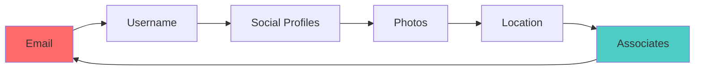

# 🔎 Ultimate OSINT Search Guide

> **Master the art of finding anything, anywhere on the internet**

<div align="center">

[](README.md)

</div>

---

## 📚 Table of Contents

- [Search by Intent](#-search-by-intent)
- [Search by Target Type](#-search-by-target-type)
- [Platform-Specific Guides](#-platform-specific-guides)
- [Advanced Techniques](#-advanced-techniques)

---

## 🎯 Search by Intent

### I want to find...

<table>
<tr>
<td width="50%">

#### 🔐 **Exposed Credentials**

**Best Tools:**
1. [GitHub Dorks](github-dorks.md) - Secret scanning
2. [Google Dorks](google-dorks.md) - File hunting
3. Have I Been Pwned - Breach data
4. DeHashed - Credential search

**Quick Start:**
```
GitHub: filename:.env DB_PASSWORD
Google: filetype:sql intext:password
Pastebin: site:pastebin.com "password"
```

**Success Rate:** ⭐⭐⭐⭐⭐

</td>
<td width="50%">

#### 📸 **A Person's Photo**

**Best Tools:**
1. Google Images - Reverse search
2. Yandex Images - Best for faces
3. PimEyes - Face recognition
4. Social Catfish - Social profiles

**Quick Start:**
```
Upload photo to:
1. images.google.com
2. yandex.com/images
3. pimeyes.com
```

**Success Rate:** ⭐⭐⭐⭐

</td>
</tr>
<tr>
<td width="50%">

#### 🌐 **Website Owner**

**Best Tools:**
1. WHOIS Lookup
2. DNS Records
3. SSL Certificate info
4. Historical data

**Quick Start:**
```
whois example.com
ViewDNS.info
crt.sh (certificate search)
```

**Success Rate:** ⭐⭐⭐⭐

</td>
<td width="50%">

#### 📱 **Social Media Profiles**

**Best Tools:**
1. Username checkers
2. Sherlock tool
3. Platform-specific search
4. Cross-referencing

**Quick Start:**
```
namechk.com
whatsmyname.app
sherlock username
```

**Success Rate:** ⭐⭐⭐⭐⭐

</td>
</tr>
<tr>
<td width="50%">

#### 🗺️ **Location from Photo**

**Best Tools:**
1. EXIF data extraction
2. Reverse image search
3. Google Earth
4. Landmark identification

**Quick Start:**
```
ExifTool for GPS data
Google Earth matching
Shadow analysis
Street signs/language
```

**Success Rate:** ⭐⭐⭐

</td>
<td width="50%">

#### 🔍 **Email Owner**

**Best Tools:**
1. Email verification
2. Breach databases
3. Social media
4. Reverse lookup

**Quick Start:**
```
hunter.io
holehe tool
epieos.com
Google: "email@example.com"
```

**Success Rate:** ⭐⭐⭐⭐

</td>
</tr>
</table>

---

## 🎭 Search by Target Type

### 👤 Person Investigation

<details>
<summary><b>Click to expand complete workflow</b></summary>

#### Phase 1: Initial Reconnaissance

1. **Collect Known Information**
   - Full name (variations)
   - Email addresses
   - Phone numbers
   - Usernames
   - Location (current/past)

2. **Username Enumeration**
   ```bash
   # Use these tools in order:
   sherlock username
   maigret username
   whatsmyname.app
   namechk.com
   ```

3. **Email Investigation**
   - Hunter.io - Find email
   - Holehe - Account finder
   - GHunt - Google info
   - DeHashed - Breaches

#### Phase 2: Social Media Deep Dive

**Platforms to Check:**
- ✅ Facebook - Family, friends, location
- ✅ LinkedIn - Work, education
- ✅ Twitter - Opinions, network
- ✅ Instagram - Photos, location
- ✅ TikTok - Videos, trends
- ✅ Reddit - Interests, opinions
- ✅ GitHub - Technical skills

**Advanced Techniques:**
```
Facebook:
- Use numeric ID search
- Check mutual friends
- Photo metadata
- Location check-ins

LinkedIn:
- Employment history
- Connections
- Skills & endorsements
- Posted content

Twitter:
- Advanced search operators
- Tweet history
- Following/followers
- Geo-tagged tweets
```

#### Phase 3: Data Aggregation

**Compile all findings:**
- Timeline of activities
- Social connections map
- Location history
- Digital footprint summary

</details>

### 🌐 Domain/Website Investigation

<details>
<summary><b>Click to expand complete workflow</b></summary>

#### Phase 1: Basic Information

1. **WHOIS Lookup**
   ```bash
   whois example.com
   # Check:
   - Registrant details
   - Registration date
   - Name servers
   - Expiration date
   ```

2. **DNS Records**
   ```bash
   dig example.com ANY
   nslookup example.com
   # Record types:
   - A (IP address)
   - MX (Mail servers)
   - TXT (Verifications)
   - NS (Name servers)
   ```

#### Phase 2: Infrastructure Mapping

1. **Subdomain Enumeration**
   ```bash
   subfinder -d example.com
   amass enum -d example.com
   # Or use:
   - crt.sh (certificates)
   - SecurityTrails
   ```

2. **Technology Stack**
   - BuiltWith.com
   - Wappalyzer
   - WhatRuns
   - Netcraft

#### Phase 3: Security Assessment

1. **Port Scanning** (authorized only!)
   ```bash
   nmap -sV example.com
   ```

2. **Vulnerability Check**
   - Shodan.io
   - Censys.io
   - CVE databases

3. **Historical Data**
   - Wayback Machine
   - Archive.today
   - Google Cache

</details>

### 📱 Phone Number Investigation

<details>
<summary><b>Click to expand complete workflow</b></summary>

#### Information to Gather

1. **Carrier Information**
   - Truecaller
   - Free Carrier Lookup
   - PhoneInfoga

2. **Location Data**
   - Area code lookup
   - Carrier tower info
   - Time zone

3. **Social Media Links**
   - Facebook phone search
   - WhatsApp check
   - Telegram lookup

4. **Reverse Lookup**
   - Whitepages
   - Spokeo
   - TruePeopleSearch

</details>

---

## 🔧 Platform-Specific Guides

### Google Dorking Masterclass

#### Beginner Level

```
Basic operators:
site:example.com
filetype:pdf
intitle:"login"
inurl:admin

Example searches:
site:example.com filetype:pdf
intitle:"index of" password
site:.gov filetype:xls
```

#### Intermediate Level

```
Combined operators:
site:example.com (filetype:pdf OR filetype:doc)
intitle:"index of" inurl:backup
site:.gov intext:"confidential" -public

Advanced examples:
site:pastebin.com "password" "2024"
inurl:wp-content/uploads filetype:sql
site:.edu filetype:xls "ssn"
```

#### Expert Level

```
Complex queries:
(site:github.com OR site:gitlab.com) "api_key" (filetype:env OR filetype:yml)
site:.gov intext:"for official use only" (filetype:pdf OR filetype:doc) after:2024-01-01

OSINT-specific:
"john.doe@example.com" -site:example.com
"+1-555-*" site:linkedin.com "New York"
site:facebook.com "lives in" "New York" "works at"
```

### Shodan Search Techniques

#### Finding Specific Devices

```
Webcams:
product:"webcam" port:80
title:"Network Camera"
"Server: webcamXP"

Databases:
port:3306 -authentication
port:27017 "MongoDB Server Information"
port:5432 PostgreSQL

Industrial Systems:
port:502 Modbus
port:102 Siemens
port:44818 PLC
```

#### Geographic Targeting

```
country:US city:"New York"
geo:40.7128,-74.0060,10
org:"Amazon.com" country:US
```

#### Vulnerability Hunting

```
vuln:CVE-2021-44228
apache version:"2.4.49"
product:"MySQL" version:"5.5"
```

---

## 🎓 Advanced Techniques

### Pivoting Strategy



**Pivoting Example:**
1. Start with email: `john.doe@gmail.com`
2. Find username: `johndoe123`
3. Search username across platforms
4. Find LinkedIn profile
5. Extract: Work history, location, connections
6. Find company email: `john.doe@company.com`
7. Search company email for more accounts
8. Repeat

### Cross-Reference Verification

**Always verify across 3+ sources:**

```
Information: "Lives in New York"

Source 1: Facebook profile
Source 2: LinkedIn location
Source 3: Geo-tagged photos
Source 4: Area code of phone
Source 5: IP address logs

✅ If 3+ sources confirm → Likely accurate
❌ If only 1-2 sources → Needs more verification
```

### OPSEC Considerations

**Maintain operational security:**

1. **Network Layer**
   ```
   VPN → Tor → Target
   Always use disposable IPs
   Rotate regularly
   ```

2. **Account Layer**
   ```
   Burner emails
   Fake personas
   Anonymous payments
   ```

3. **Documentation**
   ```
   Encrypted storage
   Timestamped screenshots
   Chain of custody
   ```

---

## 💡 Search Tips & Tricks

### Time-Saving Techniques

| Technique | Description | Time Saved |
|-----------|-------------|------------|
| **Browser Extensions** | RevEye, InVID, Who Is | 50% |
| **Automation Scripts** | Sherlock, Maigret | 70% |
| **Saved Searches** | Google Alerts, Visualping | 80% |
| **Bookmark Organization** | Category folders | 30% |

### Common Pitfalls to Avoid

❌ **Don't:**
- Trust single source
- Ignore EXIF data
- Skip verification
- Leave digital footprint
- Share findings publicly

✅ **Do:**
- Cross-reference everything
- Document timestamps
- Maintain OPSEC
- Respect privacy laws
- Report responsibly

---

## 📊 Search Effectiveness Matrix

| Target Type | Difficulty | Success Rate | Time Required |
|-------------|-----------|--------------|---------------|
| Email → Username | ⭐ Easy | 90% | 5-10 min |
| Username → Social | ⭐ Easy | 85% | 10-15 min |
| Phone → Person | ⭐⭐ Medium | 70% | 15-30 min |
| Photo → Location | ⭐⭐⭐ Hard | 50% | 30-60 min |
| IP → Person | ⭐⭐⭐⭐ Very Hard | 30% | 1-2 hours |
| Domain → Owner | ⭐⭐ Medium | 75% | 20-30 min |

---

<div align="center">

## 🚀 Ready to Start Searching?

[](README.md)
[](README.md#-search-engine-dorks)
[](README.md#-osint-tools--dashboards)

<br>

**Remember: Always obtain proper authorization before conducting investigations**

</div>
